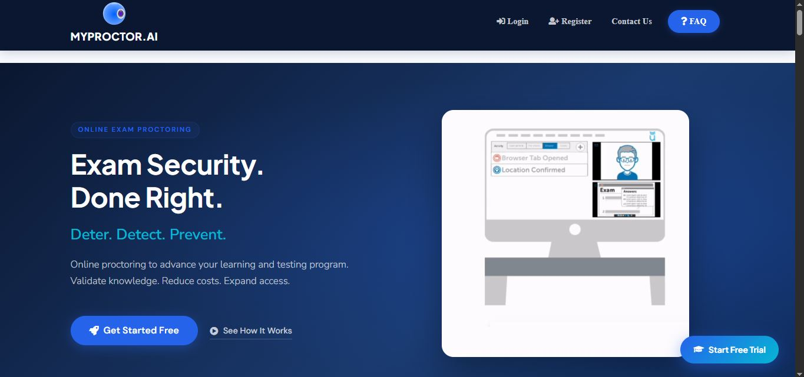
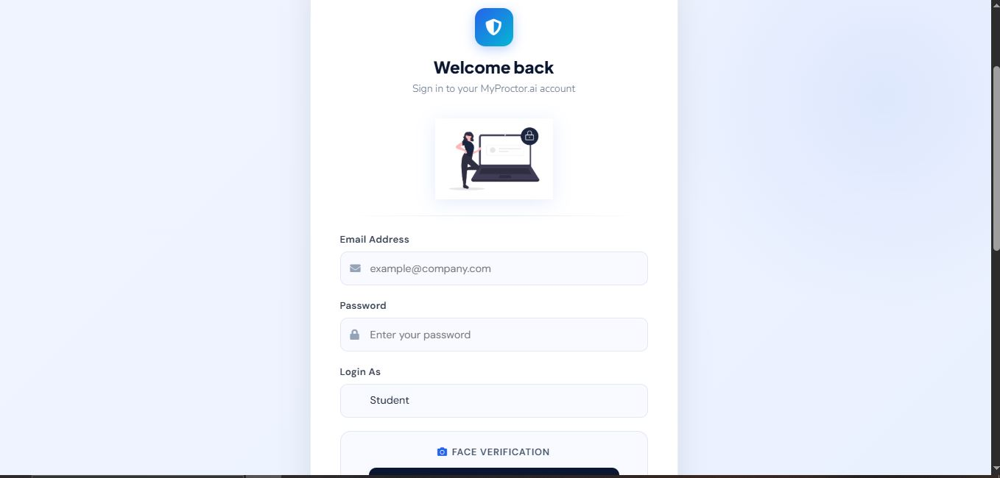
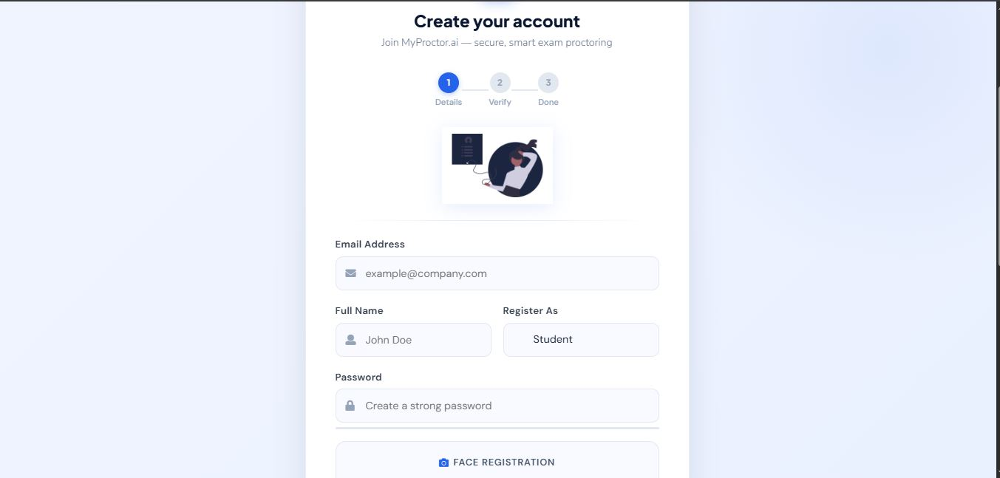
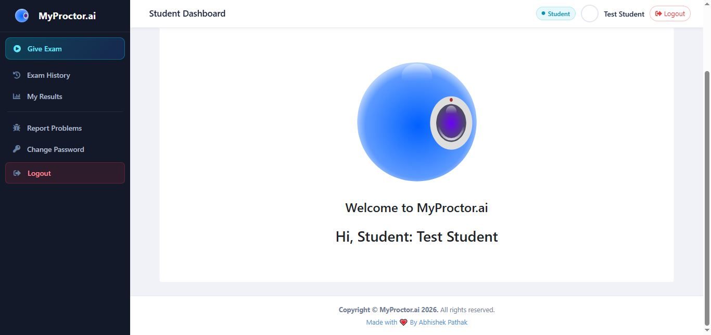
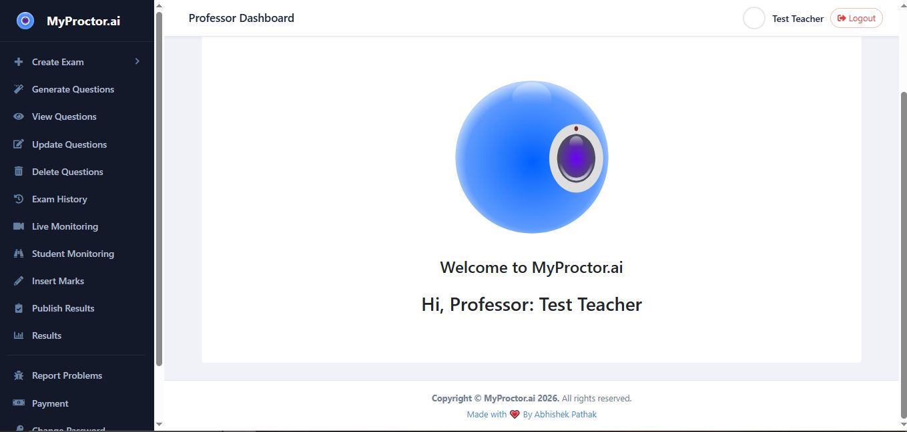

<div align="center">

<h1>🎓 MyProctor.ai</h1>
<h3>AI-Based Smart Online Examination Proctoring System</h3>

<p>
  
  
  
  
  
</p>

<p>
  
  
  
</p>

<br/>

> **An intelligent, AI-powered online examination monitoring system** that ensures academic integrity through real-time proctoring — face recognition, gaze tracking, audio monitoring, and more.

</div>

---

## 📸 Project Screenshots

<div align="center">

### 🗂️ Project Structure (VS Code)






</div>

> 📁 Project includes modules for `eye_tracking`, `gaze_tracking`, `flask_session`, `models`, and AI-powered face detection — all integrated into a Flask web application.

---

## 📌 Table of Contents

- [Overview](#-overview)
- [Key Features](#-key-features)
- [Tech Stack](#-tech-stack)
- [System Architecture](#-system-architecture)
- [Installation](#-installation)
- [Usage](#-usage)
- [Proctoring Capabilities](#-proctoring-capabilities)
- [Project Structure](#-project-structure)
- [Screenshots](#-ui-screenshots)
- [Contributing](#-contributing)
- [Developer](#-developer)

---

## 🧠 Overview

**MyProctor.ai** is a full-stack AI-powered proctoring platform built to conduct fair, monitored online examinations. It uses computer vision, machine learning, and real-time event tracking to detect cheating behaviors and generate detailed proctoring reports.

Whether it's an objective MCQ test, a subjective written exam, or a programming practical — MyProctor.ai handles it all with robust monitoring and automated result processing.

---

## ✨ Key Features

### 🔐 A) Authentication & Security
| Feature | Details |
|--------|---------|
| Login / Register | Secure authentication with session management |
| Forgot & Change Password | Built-in password recovery |
| Single Login Policy | Prevents simultaneous logins per user |
| Face Verification | AI-based identity check at login & during exam |

---

### 👨‍🏫 B) Professor Dashboard
- 🤖 **AI Question Generator** — Auto-generate Objective & Subjective Q&A using AI
- 📋 **Exam Management** — Create, update, delete, and share exams with students
- 🔒 **Exam Lock** — Update/delete blocked during & after exam for integrity
- 📊 **Live Monitoring** — View students' live exam sessions in real-time
- 📝 **Marks & Results** — Insert subjective/practical marks and publish results
- 📜 **Proctoring Logs** — View detailed violation logs per student
- 💳 **Exam Wallet** — Recharge and manage exam credits

---

### 🎓 C) Student Dashboard
- ✍️ **Take Exam** — Participate in scheduled exams
- 📂 **Exam History** — Review past examination records
- 📈 **View Results** — Check published scores and feedback
- 🚨 **Report Problems** — Submit technical or exam-related issues

---

### 📋 D) Exam Engine
| Feature | Details |
|--------|---------|
| Exam Types | Objective, Subjective, Practical |
| Timer Persistence | Timer continues even after page refresh |
| Negative Marking | Configurable penalty for wrong answers |
| Randomized Questions | Question order randomized per student |
| Calculator | Built-in calculator for math-based exams |
| 20+ Compilers | Support for programming practical exams |
| Question Bookmarking | Mark questions for later review |
| Question Grid | Navigate with Previous/Next and grid overview |
| Submission Summary | Shows all question stats before final submit |

---

## 🛡️ Proctoring Capabilities

> MyProctor.ai provides comprehensive real-time monitoring to ensure exam integrity.

| Proctoring Feature | Description |
|-------------------|-------------|
| 🪟 **Tab/Window Monitoring** | Logs every tab switch or new window event |
| 🔊 **Audio Frequency Detection** | Captures audio levels every 5 seconds |
| 📱 **Mobile Phone Detection** | Detects phones in camera frame using AI |
| 👥 **Multiple Person Detection** | Flags if more than one person is visible |
| 👁️ **Gaze Estimation** | Tracks eye movement and body position |
| 📷 **Periodic Image Logging** | Captures student snapshots every 5 seconds |
| 🚫 **Clipboard Disabled** | CUT, COPY, PASTE, and Screenshot blocked |
| 🖥️ **VM & Screen-Share Detection** | Detects virtual machines and screen recording apps *(Desktop App Only)* |

---

## 🧰 Tech Stack

```
Backend       → Python, Flask
AI/CV         → OpenCV, dlib, TensorFlow, MediaPipe
Face & Gaze   → face_detector.py, face_landmarks.py, gaze_tracking module
Frontend      → HTML5, CSS3, JavaScript, Bootstrap
Database      → SQLite / MySQL (via DB module)
Session Mgmt  → Flask-Session
Models        → saved_model.pb, COCO models (object detection)
```

---

## 🗂️ System Architecture

```
MyProctor.ai
│
├── 🔐 Auth Module         → Login, Register, Face Verification
├── 👨‍🏫 Professor Module    → Exam Creation, AI Q&A, Live Monitoring, Results
├── 🎓 Student Module      → Exam Engine, History, Results
├── 🛡️ Proctoring Engine   → Gaze, Face, Audio, Tab, Mobile Detection
└── 📊 Reporting Module    → Logs, Violation Summary, Result Publishing
```

---

## ⚙️ Installation

### Prerequisites
- Python 3.11+
- Webcam & Microphone
- Modern Web Browser (Chrome recommended)
- Windows OS *(for VM detection feature)*

### Steps

```bash
# 1. Clone the repository
git clone https://github.com/Codeabhi096/AI-Based_Exam_Proctoring_System.git
cd AI-Based_Exam_Proctoring_System

# 2. Create and activate virtual environment
python -m venv venv
venv\Scripts\activate       # Windows
# source venv/bin/activate  # Linux/Mac

# 3. Install dlib (pre-built wheel included)
pip install dlib_bin-19.24.6-cp311-cp311-win_amd64.whl

# 4. Install all dependencies
pip install -r requirements.txt

# 5. Run the application
python app.py
```

Open your browser and go to: **`http://localhost:5000`**

---

## 🚀 Usage

### 👨‍🏫 Professor
1. Login with professor credentials
2. Create an exam and configure settings (type, duration, negative marking)
3. Use AI to auto-generate questions
4. Share exam access with students
5. Monitor students live during the exam
6. View proctoring logs and insert marks after the exam
7. Publish results

### 🎓 Student
1. Register and login
2. Complete face verification
3. Enter the exam and solve questions (use bookmarks, calculator, compiler as needed)
4. Submit — all statistics shown before final submission
5. View results after professor publishes them

---

## 📁 Project Structure

```
AI-Based_Exam_Proctoring_System/
│
├── app.py                  # Main Flask application
├── camera.py               # Webcam & video stream handling
├── face_detector.py        # Face detection logic
├── face_landmarks.py       # Facial landmark processing
├── objective.py            # Objective exam logic
├── subjective.py           # Subjective exam logic
├── saved_model.pb          # Pre-trained TensorFlow model
│
├── models/                 # AI model files (COCO etc.)
├── DB/                     # Database schemas and files
├── static/                 # CSS, JS, images
├── templates/              # HTML templates
├── eye_tracking/           # Eye tracking module
├── gaze_tracking/          # Gaze estimation module
├── flask_session/          # Session management
│
├── Screenshot/             # UI screenshots
│   ├── login.JPG
│   ├── ragister.JPG
│   ├── Student_Dashboard.JPG
│   ├── Professor_Dashboard.JPG
│   └── UI.JPG
│
├── requirements.txt
├── .env
└── README.md
```

---

## 🖼️ UI Screenshots

<div align="center">

| Login Page | Register Page |
|:----------:|:-------------:|
|  |  |

| Student Dashboard | Professor Dashboard |
|:-----------------:|:-------------------:|
|  |  |

</div>

---

## 🤝 Contributing

Contributions are welcome! Here's how:

```bash
# 1. Fork the repo
# 2. Create a feature branch
git checkout -b feature/your-feature

# 3. Commit your changes
git commit -m "Add: your feature description"

# 4. Push and open a Pull Request
git push origin feature/your-feature
```

---

## 👨‍💻 Developer

<div align="center">

**HarmanjotSharma**


*If you found this project helpful, please consider giving it a ⭐ star!*

</div>

---

<div align="center">
  <sub>Built with ❤️ using Python, Flask, and AI</sub>
</div>
